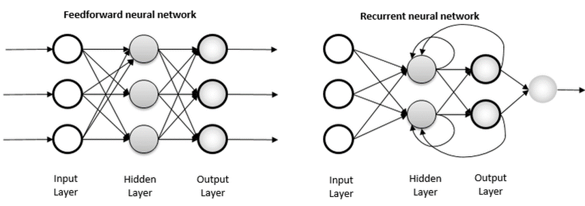
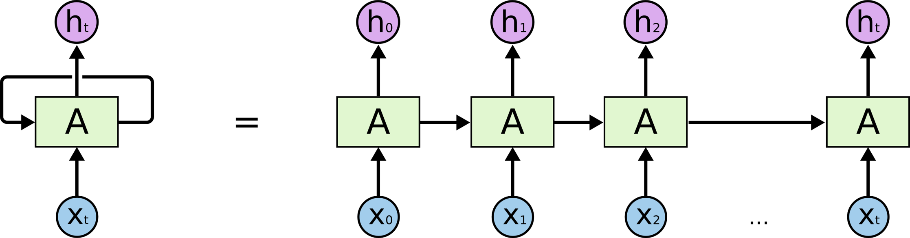

# RNN을 이용한 텍스트 분류
## 순환 신경망 (Recurrent Neural Network, RNN)
- 뉴런의 출력이 순환되는 신경망
- 입력과 출력을 시퀀스 단위로 처리하는 시퀀스(Sequence) 모델
- RNN은 가장 기본적인 인공 신경망 시퀀스 모델
### 순환 신경망의 구조


- 체인처럼 이어지는 RNN의 성질은 sequence나 list로 이어지는 것을 알려줌
### 순환신경망 예시
- 번역기
  - 입력 : 번역하고자 하는 단어의 시퀀스인 문장
  - 출력에 해당되는 번역된 문장도 단어의 시퀀스
  - 시퀀스들을 처리하기 위해 고안된 모델들을 시퀀스 모델이라고 칭함

## 텍스트 분류 (Text Classification)
- 텍스트를 입력으로 받아 텍스트가 어떤 종류의 범주에 속하는지 구분하는 작업
- RNN의 다 대 일(many-to-one) 문제에 속함
- 모든 시점(time step)에 대해 입력을 받지만, 최종 시점의 RNN 셀만이 은닉 상태를 출력 출력층으로 가서 활성화 함수를 통해 정답을 고르는 문제
### 텍스트 분류의 종류
- 이진 분류(Binary Classification)
  - 분류해야 할 범주가 2가지
  - 출력층의 활성화 함수 -> 시그모이드 함수 사용
  - 손실 함수 -> binary_crossentropy 사용
- 다중 클래스 분류(Multi-Class Classification)
  - 분류해야 할 범주가 3가지 이상
  - 출력층의 활성화 함수 -> 소프트맥스 함수 사용
  - 손실 함수 -> categorical_crossentropy 사용
  - N개의 클래스의 출력층에 해당되는 밀집층(dense layer)의 크기는 N
  - 출력층 뉴런의 수는 N개
### 텍스트 분류의 예시
- 감성 분석
  - 영화 리뷰와 같은 텍스트 입력을 받아 긍정인지 부정인지 분류
- 의도 분석
  - 입력 받은 텍스트로부터 사용자의 의도를 질문, 명령, 거절 등과 같은 의도를 분류

## 케라스 (keras) 란?
- 파이썬으로 작성된 오픈 소스 신경망 라이브러리

## 스팸 메일 분류하기 (Spam Detection)
- [스팸 메일 데이터 다운](https://www.kaggle.com/uciml/sms-spam-collection-dataset)
- 훈련데이터
  - 레이블에 정답이 적혀 있는 데이터
- 테스트 데이터
  - 훈련 데이터 전체를 학습시키지 않고 일부를 보류한 테스트용 데이터
## RNN으로 분류하기
```
model.add(SimpleRNN(hidden_units, input_shape=(timesteps, input_dim)))
```
- hidden_units = RNN의 출력의 크기 = 은닉 상태의 크기
- timesteps = 시점의 수 = 각 문서에서의 단어 수
- input_dim = 입력의 크기 = 임베딩 벡터의 차원


### Reference
- https://colah.github.io/posts/2015-08-Understanding-LSTMs/
- https://dgkim5360.tistory.com/entry/understanding-long-short-term-memory-lstm-kr
- https://wikidocs.net/24873